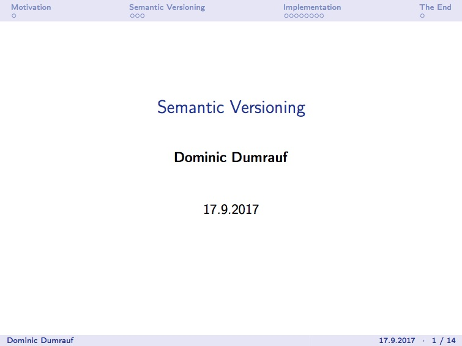

# Comparing Semantic Versions

This repository contains a fully tested and easily extendable function to compare semantic versions. See the corresponding [presentation](semantic_versioning.pdf) for more details on the function as well as semantic versioning.
<p align="center">
  <a href="semantic_versioning.pdf"></a>
</p>


## Implemented Functionality

A semantic versioning comparator `compare(version_1, version_2)` is implemented which

* accepts two version strings, referred to as `version_1` and `version_2`
* every version string may only contain integer numbers and dots
* every version string must start with an integer
* `version_1` _must_ also contain a leading _comparator_ out of a list of known comparators
* known comparators are `=`, `>`, and `>=`
* return values are only `True` or `False`


## Assumptions

The following assumptions were made:

1. `version_1` is the only version string which contains a comparator
2. The question answered by `compare(version_1, version_2)` is "`version_2` `version_1`"; i.e. `compare('>=1.0', '1.1')` answers the question of `'1.1''>=1.0'`
3. versions cannot be empty
4. Version numbers are compared from left to right, split at "."


## Implementation Notes

The `compare(version_1, version_2)` was implemented in standard Python 2.7 by

1. Splitting the comparator from `version_1` and passing it on the corresponding comparator class
2. Parsing `version_1` and `version_2` into lists of integers, splitting them at the "." symbol
3. Handing the two parsed versions to the previously detected comparator and return the result

Should any of the above steps fail, a detailed error message is being displayed.


## Known Limitations and Assumptions

As the implementation relies on list comparison, all limitations of standard Python 2.7.13 list comparision apply.


## Extensions

The task was implemented with extendability in mind. Adding a new comparator is fairly straightforward.
All that needs to be done is use of the existing comparators as a template and provide the comparator specific

* `SYMBOL` as well as
* `compare` method.

The comparator is then made available by adding it to the `KNOWN_SYMBOLS_TO_COMPARATORS_MAPPING` in the `VersionComparator` class.
Should the power of the `Version` class be leveraged, then the corresponding _magic method_ in the `Version` class has to be provided.

## Testing

As the `compare(version_1, version_2)` function does not provide any main functionality, the tests (and associated logging output) provide some insight.

Run the tests from the base directory of this project via
```
python -m unittest discover tests/
```

Note: Base Class tests are skipped on purpose as the tests require a comparator to be meaningful.


Just as the actual application is written with extendability in mind, so are the tests. Adding a new comparator is again fairly straightforward.
All that needs to be done is use of the existing comparator test cases as a template and provide the comparator specific private methods. All other functional tests are included in the base version test as they are common across all comparators.


## Using the Comparator

The function `compare(version_1, version_2)` can be used directly after importing as outlined in the [minimum example](minimum_example.py)
```
from main import compare

print compare('>3.14.159', '3.14.159.2653')
```

When run via

```
python minimum_example.py
```

the following output is printed

```
2017-09-17 19:21:06,057 - root - INFO - Found comparator ">" and version "3.14.159" in string ">3.14.159"
2017-09-17 19:21:06,058 - root - INFO - Found matching class "<class 'comparators.strictly_greater.StrictlyGreater'>" for string ">"
2017-09-17 19:21:06,058 - root - INFO - Comparing Versions:  3.14.159.2653 > 3.14.159 : True
True
```

Here, the last `True` corresponds to the expected output of the `compare('>3.14.159', '3.14.159.2653')` function as also indicated by the preceding info log message.


## Settings

The application does come with a `settings.py` module which mainly provides logging setup. It expects to be able to create a directory `.logs` (if not already present) and writes its logs to that directory as well.